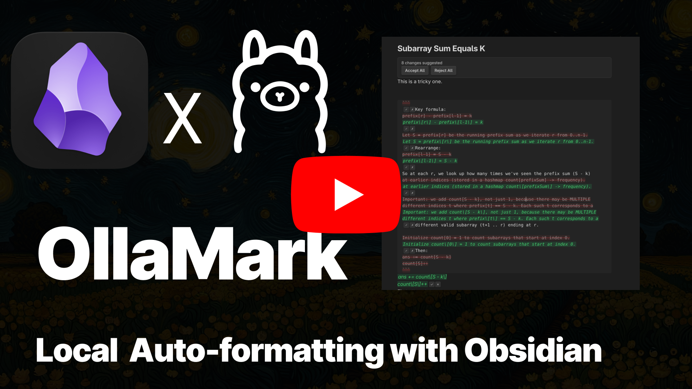

# OllaMark

> This text was auto-formatted with [OllaMark](https://github.com/Avni2000/OllaMark)

## The Problem

I *hate* formatting text in markdown and making it look pretty. It takes forever. So what if I build you an extension that solves that problem *safely*, *locally*, and *just works without an API key*? All I ask of you is some raw computing power.

I don't like to make broad generalizations, but there is very little generative natural language models are good at better than taking some input and matching it to a statistically more pleasing format. I'm biased when I say this, but I recommend giving it a try.

## What It Does

### Demo Video

[](https://youtu.be/Tst1frCahvU)

TLDW:

1. Highlight some rough text
2. Hit Hotkey or right click
3. Format rough text with local Ollama instance
...
4. Profit!

You now have (ideally) well formatted markdown. Adjust the prompt to tune the output, and feel free to play around with the model!


## Features

- **Inline diff view**: Accept or reject suggested changes without leaving your editor
- **Custom prompts**: Right-click your selection and describe what you want in plain English
- **Preset commands**: Hotkey-enabled quick actions for common formatting tasks:
  - Add headings to organize content
  - Make text more concise
  - Convert to bullet points
  - Fix grammar only (no style changes)
  - Improve paragraph flow
- **Context menu integration**: Right click any selection to format with AI
- **Completely offline**: All processing happens on your machine via Ollama

## Installation

### Prerequisites

1. Install [Ollama](https://ollama.ai) on your system
2. Pull a model. I use gemma3:4b, see FAQ for more.
   ```bash
   ollama pull gemma3:4b
   ```
3. Make sure Ollama is running (usually starts automatically)

### Install the Plugin

#### From Obsidian Community Plugins (Coming Soon)

1. Open **Settings → Community plugins**
2. Disable Safe mode
3. Search for "OllaMark"
4. Click Install, then Enable

#### Manual Installation

1. Download the latest release from [GitHub](https://github.com/Avni2000/OllaMark/releases)
2. Extract `main.js`, `manifest.json`, and `styles.css` to:
   ```
   <vault>/.obsidian/plugins/OllaMark/
   ```
3. Reload Obsidian
4. Enable OllaMark in **Settings → Community plugins**

## Usage

### Hotkeys

Assign keyboard shortcuts to preset prompts:
1. Go to **Settings → Hotkeys**
2. Search for "OllaMark"
3. Assign keys to your favorite presets

## Configuration

Open **Settings → OllaMark** to configure:

- **Ollama URL**: Where Ollama is running (default: `http://localhost:11434`)
- **Model**: Choose from your locally installed models

## Development

```bash
# Install dependencies
npm install

# Dev mode with hot reload
npm run dev

# Production build
npm run build
```

## Why Local?

Your notes are private. Your thoughts are private. Sending them to external APIs, even "private" ones, is a risk I'm not willing to take with my own notes, so I won't ask you to take it with yours.

Ollama runs entirely on your machine. Nothing leaves. No telemetry, no analytics, no cloud processing. Just you, your vault, and your GPU/CPU doing the work.

## FAQ

**Q: Which models work best?**  
A: I have no idea. I've experimented with a few, but not enough to make a proper suggestion. I'm just running an instance of gemma3:4b. Obviously, larger models give better results but run slower and can eat up memory really quickly. Perhaps someone willing to run benchmarks will come back and contribute more information.

**Q: Does this work on mobile?**  
A: Not yet. Ollama requires a desktop environment. Mobile support would require a remote Ollama instance, which defeats the privacy purpose.

**Q: Can I use this with remote Ollama?**
A: Yes, change the Ollama URL in settings. But be aware you're sending note content over the network.

**Q: Does this replace my writing?**  
A: No. It's an autoformatter, not a content generator. It cleans up what you've already written. Think of it like a code formatter like Prettier, or spellcheck with better context.

## Contributing

Issues and PRs welcome as always.

---

Built by [Avni Badiwale](https://github.com/Avni2000) because I got tired of manually formatting markdown notes.

